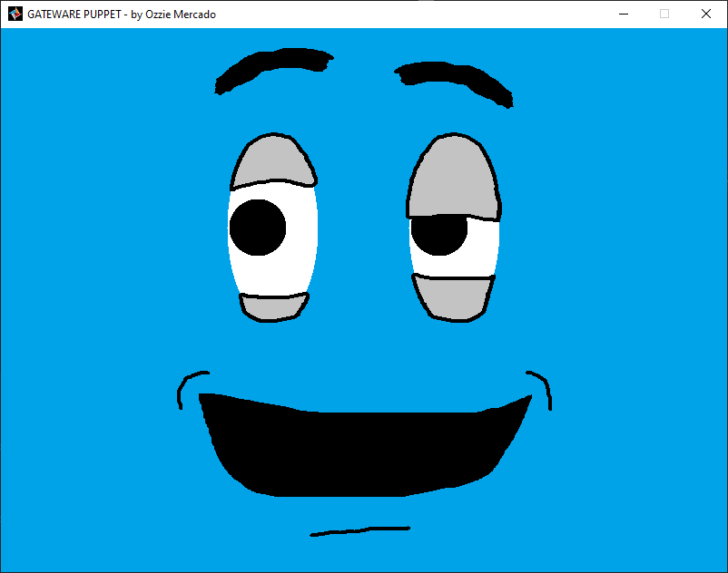

# Gateware Puppet
 

The Gateware Puppet is a toy that can be manipulated using a controller. You can change the expression on the puppet's face by individually controlling the puppet's eyes, eyebrows, eyelids, mouth, and face color. This project was created to demonstrate some of the features I worked on for version 1.2a of the [Gateware](https://gitlab.com/gateware-development/gateware/-/releases) game development tool.

### Features demonstrated that I added to Gateware include:
- Xbox One controller support for Mac and Linux.
- PS4 controller support for Mac and Linux.
- Dynamic icon setting at runtime.
- Turning off user window resizing.
- Stability improvements with controller connections on Windows and Linux.
- Distinction of controller connection type on Mac and Linux.
- Wireless controller input mappings on Mac and Linux.

## Platforms Supported
- Windows with Visual Studio 2019.
- Linux with CodeLite 13.0.

## Controllers Supported
The project uses Gateware's GController library and therefore supports the same controllers supported by that library.

#### On Windows:
- Xbox 360
- Xbox One

#### On Mac & Linux:
- Xbox 360
- Xbox One
- PS4

## Getting Started
#### On Windows
1. Clone the repository.
2. Navigate to the GatewarePuppet/scripts folder.
3. If CMake is not installed, [install CMake.](https://cmake.org/download/)
4. Run Win32Setup.bat to setup the project solution.
5. Navigate to the GatewarePuppet/build/VisualStudio folder.
6. Open GatewarePuppet.sln
7. In the "Solution Explorer" right-click on "GatewarePuppet" and select "Set as Startup Project"
8. You can now build and run the project. A controller is required to manipulate the puppet.

#### On Linux
1. Clone the repository.
2. Navigate to the GatewarePuppet/scripts folder.
3. If CMake is not installed, [install CMake.](https://cmake.org/download/)
4. Run LinuxSetup.bat to setup the project workspace.
5. Navigate to the GatewarePuppet/build/debug folder.
6. Open GatewarePuppet.workspace in CodeLite
7. You can now build and run the project. A controller is required to manipulate the puppet.

## Links
- Learn more about [my contributions to Gateware.](https://www.ozziemerc.com/gateware)
- See more projects I've worked on at [my website.](https://www.ozziemerc.com)
- Learn more about Gateware at [the official Gateware repository](https://gitlab.com/gateware-development)
